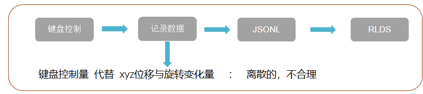
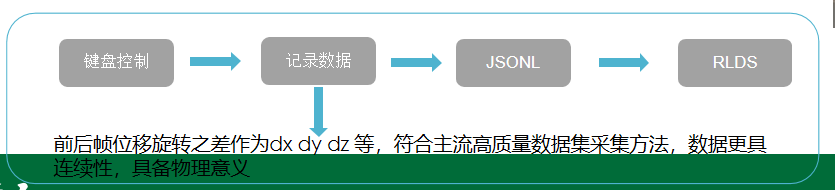

# 周报
## 一、当前任务
1）VLA在Mujoco(Robosuite)平台下的仿真与训练
2）项目：电力物资检测远程督导具身智能机器人
3）项目：基于具身空间的架空输电线路运检关键技术及装备研究

## 二、本周工作
1、VLA在Mujuco(Robosuite)平台下的仿真与训练

新问题：从视频中可见，机械臂虽然有了动作，并且有朝物块移动的倾向，但是并没有完成“移动定位-夹爪闭合抓取-举起物块”的动 作，仅仅有了移动定位这一步，并且没有准确找到物块分析：经查阅资料，初步确认是键盘控制机械臂数据采集记录逻辑存在问题。
          
 最初的采集策略：

       
修改后的策略：

2、项目：基于具身空间的架空输电线路运检关键技术及装备研究

​      文献调研：

​      《ChatHTN: Interleaving Approximate (LLM) and Symbolic HTN Planning》

​        和项目中“HTN 主骨架 + LLM 做语义/补全”思路接近，把 LLM 只放在“方法库不足时补分解”的位置

​      《NL2Plan: Robust LLM-Driven Planning from Minimal Text Descriptions》
​       
​        自然语言到 PDDL 的结构化建模流程，“分步抽取”思路，而不是让 LLM 一步到位出计划

## 三、下周任务

1）重新推理查看新策略数据下的效果      5月10日
2）阅读ChatHTN论文并思考其复现价值  5月13日前完成
3）继续学习项目所用的相关软件工具(Unity)       5月内

