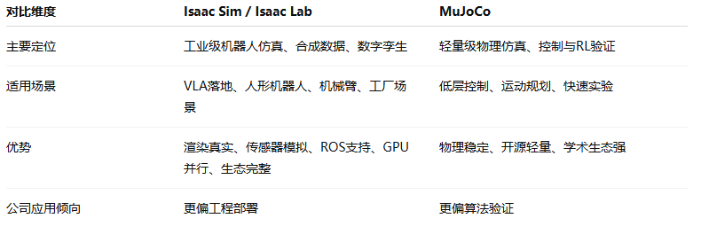
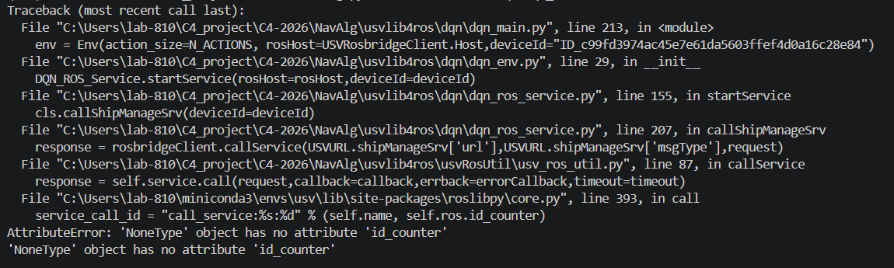

# 周报
## 一、当前任务
1）项目：基于具身空间的架空输电线路运检关键技术及装备研究
2）VLA平台建设：VLA在Mujuco(Robosuite)平台下的仿真与训练
3）C4平台赛事测试

## 二、本周工作
1）VLA sim to real 主力方案调研  Isaac 与 Mujoco

结论：目前更主流的是 NVIDIA Isaac 系列，尤其是 Isaac Sim + Isaac Lab；MuJoCo 仍然常用于研究原型和低层控制验证。

在现有具身智能公司中，若目标是 VLA 系统落地与 sim-to-real 工程闭环，Isaac 系列使用更普遍。

​		公开资料上，NVIDIA 明确把 Isaac Sim 定位为机器人仿真、测试和合成数据生成框架，并支持 Isaac Lab 进行机器人学习、软件在环/硬件在环评估、合成数据生成和 ROS/ROS2 连接，这些正好对应公司做 sim-to-real 的工程需求。

公司案例:

1.Agility Robotics 在 2026 年文章中说它同时使用 NVIDIA 相关框架和 MuJoCo 来生成虚拟物理环境，但其“simulation-first workflow”明确使用 NVIDIA Isaac Lab 做强化学习训练；他们还把 VLA 放在高层认知/规划层，把 RL + simulation 放在底层控制层。 这说明一个很典型的工业栈：VLA 负责语义/任务，Isaac/MuJoCo 等仿真负责动作、控制、数据和验证。

2.Lightwheel：它用 Isaac Sim + Isaac Lab + Omniverse + GR00T N1.5 VLA foundation model 建立仿真优先平台，用合成数据微调 VLA，并声称已在 Geely 工厂的 Unitree H1 人形机器人上部署。其客户/合作对象列表还包括 AgiBot、BYD、ByteDance、Figure、Fourier、Galbot、Geely、Google DeepMind、Zordi。

2）C4平台部署与测试

1.C4平台部署

按照提供的资料与测试大纲进行部署，结果如下：
平台启动流程测试：
TC-001：ROS2 端一键启动    通过
TC-002：EmboUnity 仿真场景加载  通过
TC-002A：MATLAB Simulink 模型启动  通过
TC-003：Python 客户端连接 ROS2  通过

2.强化学习平台测试    未通过，仍有问题

按照资料修改Python端强化学习代码中的ID以及IP后，运行算法报错如下：

## 三、下周任务

1）C4赛事平台测试       
2）推进项目资料搜索与学习

