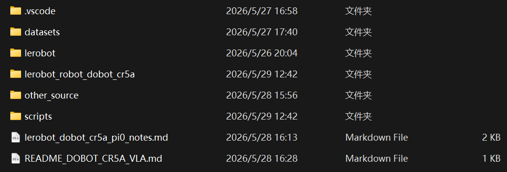

# 周报
## 一、当前任务
1）项目：基于具身空间的架空输电线路运检关键技术及装备研究
2）VLA平台建设
3）C4平台赛事测试

## 二、本周工作
1）LeRobot + DOBOT CR5 A + PI 0 适配工作

计划使用Lerobot框架将Pi0部署在实验室机械臂上，目前已完成机械臂注册相关代码的撰写

2）VLA评价指标调研

VLA部署相关主要指标：

| 评价维度                 | 英文指标                           | 中文翻译                  | 指标说明                                                    | 常见计算方式 / 用途                        |
| ------------------------ | ---------------------------------- | ------------------------- | ----------------------------------------------------------- | ------------------------------------------ |
| **任务完成能力**         | **Success Rate, SR**               | 任务成功率                | 衡量机器人是否完整完成语言指令对应的任务，是 VLA 最核心指标 | 成功次数 / 总测试次数                      |
|                          | **Average Success Rate**           | 平均成功率                | 多个任务、多个场景或多个 benchmark 上的平均成功率           | 各任务 SR 求平均                           |
|                          | **Per-task Success Rate**          | 单任务成功率              | 分别统计每个具体任务的完成情况                              | 每个任务单独计算 SR                        |
|                          | **Partial Success**                | 部分成功率 / 部分完成得分 | 对复杂任务中完成部分子目标的情况进行评分                    | 例如完成抓取但未完成放置，可给 0.5 分      |
| **泛化能力**             | **Seen Success Rate**              | 已见任务成功率            | 模型在训练中出现过的任务、物体或环境上的成功率              | 用于判断模型对训练分布的拟合能力           |
|                          | **Unseen Success Rate**            | 未见任务成功率            | 模型在训练中未出现过的任务、物体或环境上的成功率            | 用于衡量泛化能力                           |
|                          | **Spatial OOD Success Rate**       | 空间分布外成功率          | 改变目标物初始位置、姿态、摆放区域后的成功率                | 检验模型是否依赖固定轨迹                   |
|                          | **Object OOD Success Rate**        | 物体分布外成功率          | 更换新物体、新类别、新颜色或新形状后的成功率                | 检验模型对物体语义和视觉特征的泛化         |
|                          | **Scene OOD Success Rate**         | 场景分布外成功率          | 更换桌面、背景、光照、相机视角后的成功率                    | 检验实机环境鲁棒性                         |
|                          | **Cross-embodiment Success Rate**  | 跨本体成功率              | 模型迁移到不同机械臂或不同夹爪后的成功率                    | 用于多机器人平台泛化研究                   |
| **语言理解能力**         | **Instruction-following Accuracy** | 指令跟随准确率            | 判断机器人是否真正按照语言指令执行，而不是只完成相似动作    | 完全符合指令的次数 / 总次数                |
|                          | **Target Object Accuracy**         | 目标物体选择准确率        | 多物体场景中是否选中了语言指定的目标物                      | 选对目标物次数 / 总次数                    |
|                          | **Attribute Grounding Accuracy**   | 属性理解准确率            | 是否正确理解颜色、形状、类别、大小等属性                    | 如“抓红色方块”是否抓到红色方块             |
|                          | **Spatial Relation Accuracy**      | 空间关系理解准确率        | 是否理解“左边”“右边”“放入”“靠近”等空间语义                  | 适合多物体空间关系任务                     |
|                          | **Paraphrase Robustness**          | 指令改写鲁棒性            | 同一任务换不同语言表达后是否仍能完成                        | 例如 “pick up the cup” 换成 “grab the mug” |
|                          | **Wrong-target Rate**              | 错误目标率                | 抓错、放错或操作错误物体的比例                              | 错误目标次数 / 总次数，越低越好            |
| **实时部署能力**         | **Inference Latency**              | 推理延迟                  | 从输入图像/状态到模型输出动作所需时间                       | 单位通常为 ms 或 s，越低越好               |
|                          | **End-to-end Latency**             | 端到端延迟                | 包括图像采集、预处理、模型推理、动作发送的总延迟            | 更接近真实部署性能                         |
|                          | **Throughput**                     | 动作生成吞吐量            | 单位时间内能生成多少动作或 action chunk                     | actions/s 或 chunks/s，越高越好            |
|                          | **Control Frequency**              | 控制频率                  | 机器人实际执行闭环控制的频率                                | 常见为 5 Hz、10 Hz、25 Hz、50 Hz           |
|                          | **VRAM / GPU Memory**              | 显存占用                  | 模型推理或训练时占用的 GPU 显存                             | 用于判断是否适合低成本 GPU                 |
|                          | **Model Parameters**               | 模型参数量                | 模型规模大小                                                | 例如 450M、3B、7B                          |
|                          | **FLOPs / Compute Cost**           | 计算量                    | 模型一次推理所需计算开销                                    | 用于轻量化模型对比                         |
| **动作质量与控制稳定性** | **Completion Time**                | 任务完成时间              | 从任务开始到成功完成所需时间                                | 越短说明执行效率越高                       |
|                          | **Trajectory Smoothness**          | 轨迹平滑度                | 衡量机械臂运动是否平滑、是否抖动                            | 可通过速度、加速度、jerk 计算              |
|                          | **Jerk**                           | 加加速度                  | 反映轨迹突变程度，jerk 越大动作越不平滑                     | 适合评价机械臂运动稳定性                   |
|                          | **Path Length**                    | 运动路径长度              | 末端执行器完成任务所走过的总路径                            | 路径越短通常效率越高                       |
|                          | **Endpoint Error**                 | 末端误差                  | 最终末端位置与目标位置之间的误差                            | 常用于放置、插入、对准类任务               |
|                          | **Zero-action Ratio**              | 零动作比例                | 输出动作接近 0 的比例                                       | 可用于诊断模型“不动”或动作退化问题         |
|                          | **Stagnation Ratio**               | 停滞比例                  | 机械臂长时间没有明显运动或任务没有推进的比例                | 对低成本机械臂部署很有价值                 |
|                          | **Repeated Action Rate**           | 重复动作比例              | 连续输出几乎相同动作的比例                                  | 可用于发现动作塌缩问题                     |
|                          | **Action Saturation Rate**         | 动作限幅比例              | 动作输出达到控制器最大限制的比例                            | 过高说明模型输出不稳定或未正确归一化       |
| **安全性**               | **Collision Rate**                 | 碰撞率                    | 机器人与环境、桌面、物体或自身发生碰撞的比例                | 碰撞次数 / 总测试次数                      |
|                          | **Near-collision Rate**            | 近碰撞率                  | 接近碰撞但未真正碰撞的危险行为比例                          | 可通过距离阈值判断                         |
|                          | **Intervention Rate**              | 人工干预率                | 实验中需要人为接管、暂停或纠正的比例                        | 人工干预次数 / 总测试次数                  |
|                          | **Workspace Violation Rate**       | 工作空间越界率            | 机器人动作超出预设安全工作空间的比例                        | 用于实机安全约束评价                       |
|                          | **Emergency Stop Count**           | 急停次数                  | 实验过程中触发急停的次数                                    | 越低越安全                                 |
|                          | **Unsafe Action Rate**             | 危险动作比例              | 输出可能导致碰撞、越界、过快运动的动作比例                  | 可结合规则或安全检测器计算                 |
| **数据效率**             | **Demos per Task**                 | 单任务示范数量            | 每个任务需要多少条人工示范数据                              | 越少说明数据效率越高                       |
|                          | **Few-shot Success Rate**          | 少样本成功率              | 使用少量示范数据微调后的成功率                              | 如 5、10、20 条 demonstrations 下的 SR     |
|                          | **Success vs. Demo Number**        | 成功率-数据量曲线         | 不同数据量下模型性能变化                                    | 用于比较数据利用效率                       |
|                          | **Fine-tuning Time**               | 微调时间                  | 模型适配新任务所需训练时间                                  | 单位为分钟、小时或 GPU hours               |
|                          | **Fine-tuning Steps**              | 微调步数                  | 模型完成适配训练所需迭代步数                                | 适合对比训练效率                           |
|                          | **Data Collection Time**           | 数据采集时间              | 采集实机示范数据所需人工时间                                | 反映真实部署成本                           |
| **长程任务能力**         | **Average Chain Length**           | 平均连续完成任务长度      | 机器人能连续完成多少个子任务                                | CALVIN 等长程任务常用                      |
|                          | **Long-horizon Success Rate**      | 长程任务成功率            | 完整完成多步骤任务的比例                                    | 例如“拿起杯子→倒入盒子→关上抽屉”           |
|                          | **Step-wise Success Rate**         | 分步成功率                | 分别统计第 1、2、3、4、5 步任务成功率                       | 用于分析长程任务失败发生在哪一步           |
|                          | **Recovery Success Rate**          | 失败恢复成功率            | 出现小失败后，模型能否重新调整并完成任务                    | 对真实机器人部署很重要                     |
|                          | **Self-correction Count**          | 自我修正次数              | 模型在执行过程中主动修正错误的次数                          | 例如重新抓取、重新对准、二次放置           |

针对部署最核心的指标：

| 优先级   | 指标                       | 原因                         |
| -------- | -------------------------- | ---------------------------- |
| 必选     | **Success Rate**           | 最核心，所有论文都需要       |
| 必选     | **Average Success Rate**   | 多任务整体性能               |
| 必选     | **Latency**                | 判断是否能实时控制           |
| 必选     | **Control Frequency**      | 判断实机闭环控制能力         |
| 必选     | **Target Object Accuracy** | 判断语言指令是否真正起作用   |
| 强烈建议 | **Zero-action Ratio**      | 很适合诊断机械臂“不动”问题   |
| 强烈建议 | **Stagnation Ratio**       | 很适合分析动作退化和执行停滞 |
| 强烈建议 | **Intervention Rate**      | 反映真实部署稳定性           |
| 可选     | **Collision Rate**         | 用于安全性评估               |
| 可选     | **Few-shot Success Rate**  | 用于证明数据效率             |

## 三、下周任务

1）理解项目新增资料       
2）测试已完成的Pi0机械臂注册代码是否有效

3）Issac 仿真环境搭建

