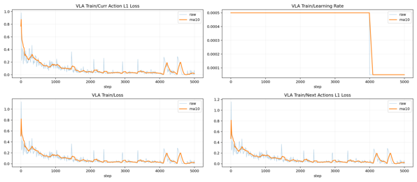
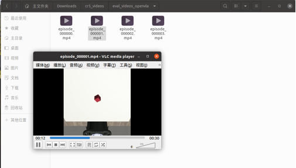
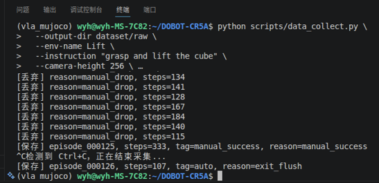
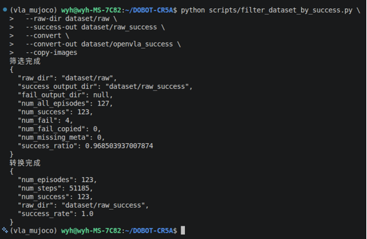

# 周报
## 一、当前任务
1）VLA在Mujoco(Robosuite)平台下的仿真与训练
2）项目：电力物资检测远程督导具身智能机器人
3）项目：基于具身空间的架空输电线路运检关键技术及装备研究

## 二、本周工作
### 1、成功打通了OpenVLA-OFT+CR5机械臂在robosuite环境下的 数据采集——VLA微调——服务器单端仿真与推理 流程
（1）对上一阶段采取29条仿真数据训练的模型在4090服务器上进行推理，运行时推理端发送action
（2）开启仿真环境端，接收推理端发送的action信息，由于服务器是无头的，故以mp4的形式保存推理可视化结果
（3）推理结果：视频中机械臂基本不动  猜测原因：数据集过少(29epoch)，训练步数太小（5000step），本次实验只是以打通流程为目标，接下来准备采集较大数据集并进行长步数训练。

训练loss曲线呈下降趋势，但推理结果效果很差，准备精采数据集并提高训练步长，再看推理效果如何

### 2、进行第二次精采数据集，增加采集数量，并转换为VLA友好的JSONL格式

采集过程中尽量保持机械臂动作连贯，避免小动作移动，提高数据集质量采集过程中进行数据集成功、失败标注，之后通过脚本筛选出成功字段的数据集，再转换为VLA训练所需格式，作为最终的数据集

## 三、下周任务

1）进行第二次OpenVLA-OFT训练

