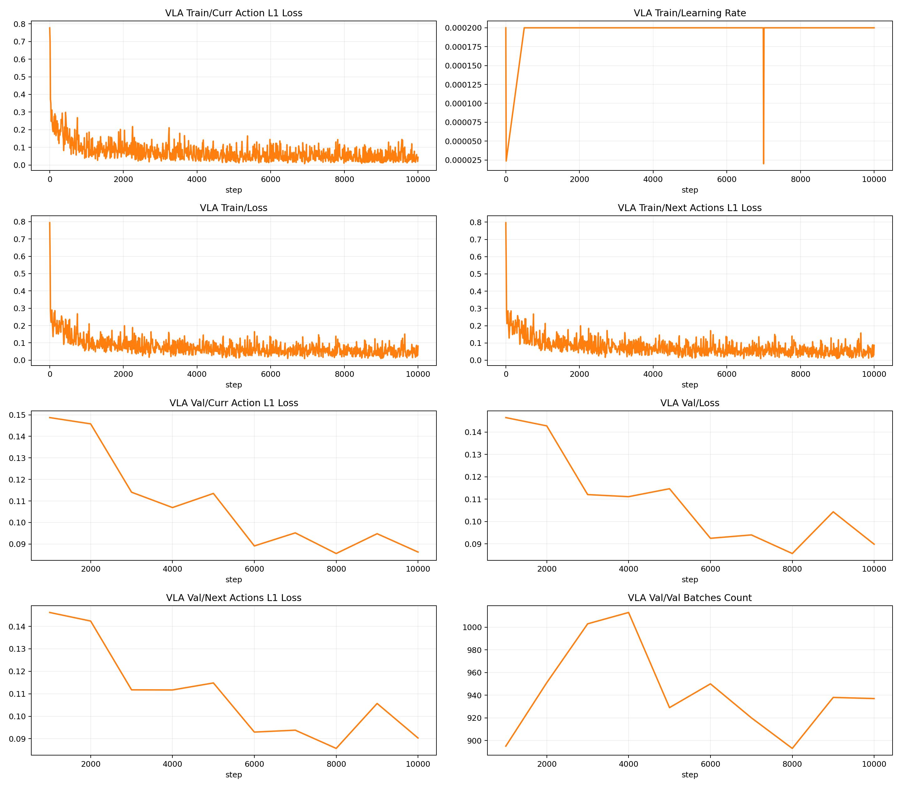

# 周报
## 一、当前任务
1）VLA在Mujoco(Robosuite)平台下的仿真与训练
2）项目：电力物资检测远程督导具身智能机器人
3）项目：基于具身空间的架空输电线路运检关键技术及装备研究

## 二、本周工作
**问题：**

重新采集数据集之后，再次进行训练，输出推理视频，机械臂依然和上次一样没有动作

**分析：**

1. 模型确实在返回动作，但动作很“小且单一”

- 直接请求 /act，返回 shape 为 (8,7)，不是空响应。
- 单次 chunk 的 8 个动作都非常接近：xyz 大约在 -0.014 到 -0.008，旋转维几乎全 0，夹爪接近 -0.97。
- 这说明不是“没输出”，而是“持续输出低幅动作 + 强夹爪偏置”。

2. 在环境里实测，末端位移接近静止

- 逐步打印 rollout 时，|act_xyz| 约 0.014 左右。
- 每步末端位移 eef_delta 只有约 1e-5 到 1e-4 量级，视觉上基本就是不动。
- reward 持续 0。

3. 数据分布本身有明显“静止偏置”

- 对训练集统计：约 61.44% 样本是前 6 维几乎全零、只有夹爪动作。
- 非零比例也很低：x 约 3.83%，y 约 5.05%，z 约 33.21%，旋转三维几乎恒 0。
- 与服务输出特征一致，说明模型学到“保守小动作”是合理现象，尤其在 5k checkpoint 阶段。

**结论**

- 当前问题不是推理端连接问题。
- 当前主要瓶颈是策略输出分布塌缩为低幅动作（特别是 5k checkpoint），导致机械臂几乎静止、任务奖励始终为 0。

**解决思路**

1. 先切到更高步数 checkpoint（至少 10k/20k）做同样的动作幅值探针，确认是否脱离“低幅常值区”（无效）。
2. 对训练数据做去静止重采样：降低“仅夹爪、位移近零”帧占比，再重训。
3. 给评测加动作监控阈值：若连续 N 步 |act_xyz| 低于阈值则直接标记为策略停滞，避免误判“服务正常即策略正常”。

**修改：**

1. 新增推理动作增益开关，解决模型输出幅值过小导致“看起来不动”的问题

- 修改文件：policy_openvla_http.py:20
- 新增环境变量：OPENVLA_XYZ_SCALE、OPENVLA_ROT_SCALE、OPENVLA_GRIPPER_SCALE
- 动作在发送到环境前会先做缩放，再做 [-1, 1] 裁剪

2. 新增 JSONL 动作清洗脚本（中间处理，不是训练终格式）

- 新增文件：filter_openvla_actions.py
- 功能：按 xyz 动作阈值过滤静止帧、保留夹爪切换帧、稀疏保留静止帧、重排 t、更新 num_steps

3. 已完成 k=8 版本清洗并产物落盘

- 清洗后 JSONL：episodes.filtered.k8.jsonl
- 清洗统计：filter_actions_summary.k8.json
- 网格报告：filter_grid_summary.json

4. 已将清洗后的 JSONL 转换为独立 RLDS 数据根，并验收通过

- train/val shard 与 dataset_info 一致：train 32，val 2，总 episode 123

5. 重新训练10k步
6. 

## 三、下周任务

1）进行修改后模型的推理，根据训练曲线，选取第8000步的checkpoint进行推理。

2）学习Unity基础入门，为后续项目推进打下基础

