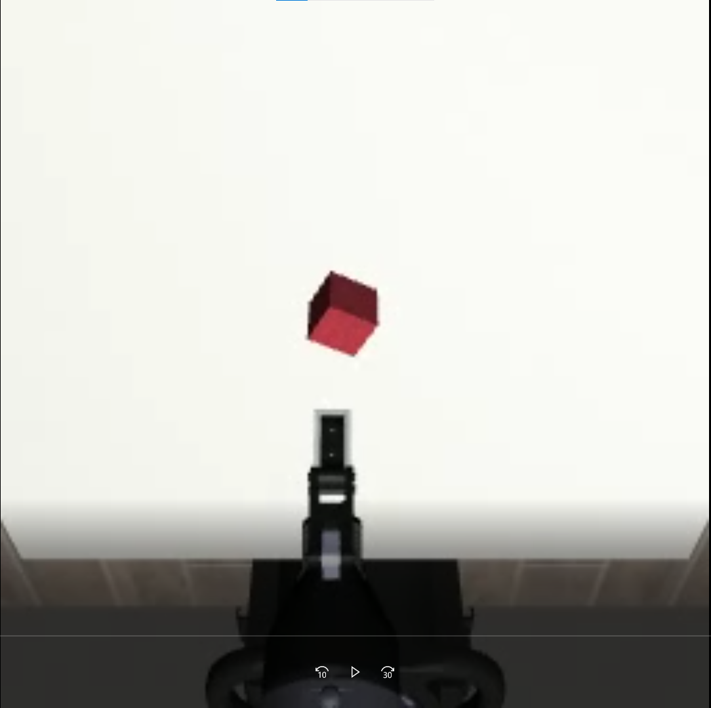
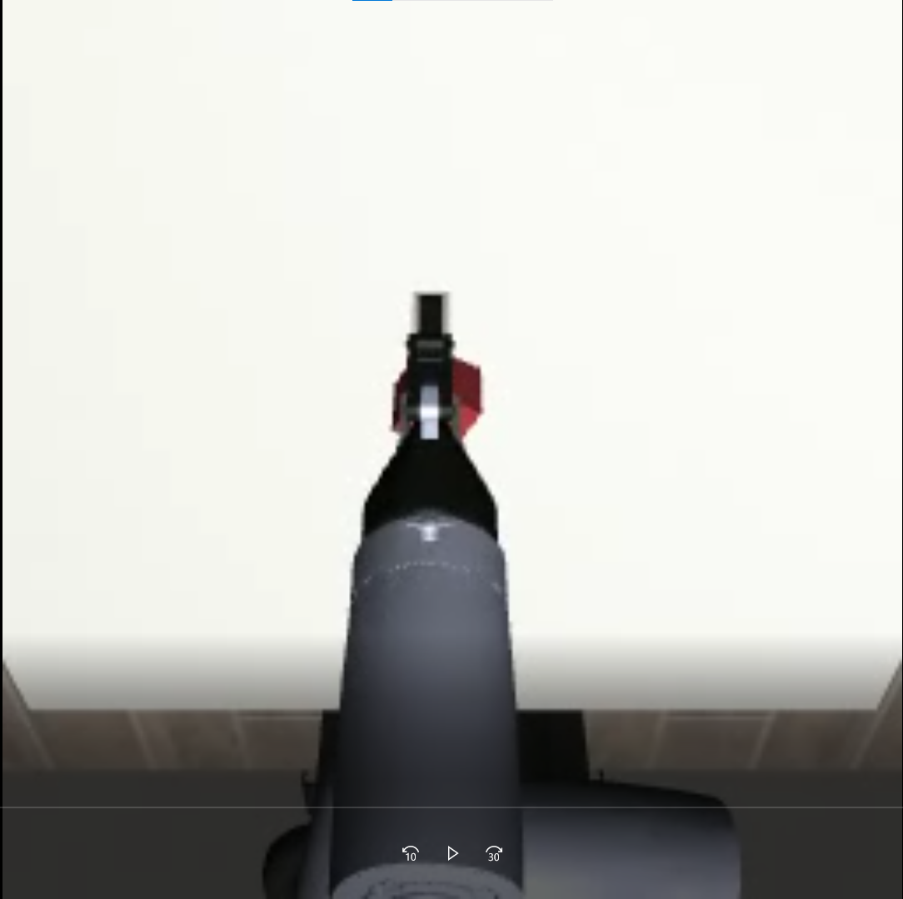
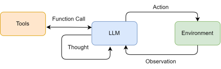
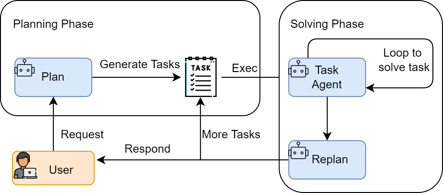

# 周报
## 一、当前任务
1）VLA在Mujoco(Robosuite)平台下的仿真与训练
2）项目：电力物资检测远程督导具身智能机器人
3）项目：基于具身空间的架空输电线路运检关键技术及装备研究

## 二、本周工作
1）VLA在Mujuco(Robosuite)平台下的仿真与训练

经过上周的一系列修改，robotsuite仿真环境下推理时，机械臂不再是静止不动，目前已经能够将夹爪末端移动到物块附近，但是并未成功抓取并拿起，如视频所示，目前夹爪定位到物块的位置也不准确。

2）Unity学习
本周学习了Unity软件基础操作，如软件UI功能、物块对象设置、场景构建等基本知识。

3）LLM Agent经典构建范式学习

ReACT:

 Plan and Solve:

Plan-and-Solve Prompting 由 Lei Wang 在2023年提出[2]。其核心动机是为了解决思维链在处理多步骤、复杂问题时容易“偏离轨道”的问题。
与 ReAct 将思考和行动融合在每一步不同，Plan-and-Solve 将整个流程解耦为两个核心阶段：
规划阶段 (Planning Phase)： 首先，智能体会接收用户的完整问题。它的第一个任务不是直接去解决问题或调用工具，而是将问题分解，并制定出一个清晰、分步骤的行动计划。这个计划本身就是一次大语言模型的调用产物。
执行阶段 (Solving Phase)： 在获得完整的计划后，智能体进入执行阶段。它会严格按照计划中的步骤，逐一执行。每一步的执行都可能是一次独立的 LLM 调用，或者是对上一步结果的加工处理，直到计划中的所有步骤都完成，最终得出答案。
这种“先谋后动”的策略，使得智能体在处理需要长远规划的复杂任务时，能够保持更高的目标一致性，避免在中间步骤中迷失方向。

## 三、下周任务

1）继续分析解决VLA失败问题
2）调研LLM与HTN进行任务分解相关文献资料
3）继续学习项目所用的相关软件工具

